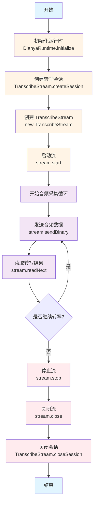

# Dianya API SDK - Java 使用示例

本文档提供了 Dianya API SDK 在 Android/Java 环境下的完整使用示例。

## 目录

- [初始化](#初始化)
- [实时转写](#实时转写)
- [文件上传转写](#文件上传转写)
- [查询转写状态](#查询转写状态)
- [翻译功能](#翻译功能)
- [生成摘要](#生成摘要)
- [导出转写结果](#导出转写结果)
- [分享链接](#分享链接)
- [回调处理](#回调处理)

## 初始化

在使用任何 API 之前，必须先初始化运行时：

```java
import com.dianya.api.DianyaRuntime;

// 初始化运行时（通常在 Application 或 Activity 的 onCreate 中调用）
DianyaRuntime.initialize();

// 使用完成后可调用 shutdown 释放资源（可选）
// DianyaRuntime.shutdown();
```

## 实时转写

实时转写使用 WebSocket 连接，支持流式音频输入和实时文本输出。

### 流程图



### 基本使用

```java
import com.dianya.api.DianyaRuntime;
import com.dianya.api.ModelType;
import com.dianya.api.TranscribeStream;
import com.dianya.api.TranscribeStream.SessionCreateResponse;
import com.dianya.api.TranscribeStream.SessionCloseResponse;

// 1. 初始化运行时
DianyaRuntime.initialize();

// 2. 创建转写会话
String token = "Bearer YOUR_TOKEN_HERE";
SessionCreateResponse session = TranscribeStream.createSession(ModelType.SPEED, token);
String sessionId = session.sessionId;
String taskId = session.taskId;

// 3. 创建并启动转写流
TranscribeStream stream = new TranscribeStream(sessionId);
stream.start();

// 4. 发送音频数据（PCM 16-bit, 16kHz, 单声道, 小端）
byte[] audioData = getAudioData(); // 从麦克风或其他音频源获取
stream.sendBinary(audioData);

// 5. 读取转写结果（非阻塞，超时 500ms）
String result = stream.readNext(500);
if (result != null && !result.isEmpty()) {
    // 解析 JSON 消息
    // 消息类型包括: "asr_result", "asr_result_partial", "stop", "error"
    System.out.println("转写结果: " + result);
}

// 6. 停止并关闭流
stream.stop();
stream.close();

// 7. 关闭会话
SessionCloseResponse closeResponse = TranscribeStream.closeSession(
    taskId, 
    token, 
    30 // 超时时间（秒）
);
```

### 使用 TranscribeStreamManager（推荐）

`TranscribeStreamManager` 提供了更高级的封装，自动管理音频采集和转写流程：

```java
import com.dianyaapi.example.TranscribeStreamManager;
import com.dianya.api.ModelType;

String token = "Bearer YOUR_TOKEN_HERE";

TranscribeStreamManager manager = new TranscribeStreamManager(token, new TranscribeStreamManager.Listener() {
    @Override
    public void onStateChanged(@NonNull StreamState newState) {
        // 状态变化：IDLE, STARTING, RUNNING, STOPPING
        System.out.println("状态: " + newState);
    }

    @Override
    public void onStatus(@NonNull Status status, @Nullable String detail) {
        // 状态更新：INITIALIZING, SESSION_CREATED, STARTED, STOPPING, STOPPED, SESSION_CLOSED
        System.out.println("状态: " + status + ", 详情: " + detail);
    }

    @Override
    public void onTranscript(@NonNull String transcript) {
        // 收到转写结果（JSON 字符串）
        System.out.println("转写: " + transcript);
    }

    @Override
    public void onError(@NonNull ErrorType type, @Nullable String detail) {
        // 错误处理：SESSION, AUDIO, READ, CLOSE
        System.err.println("错误 [" + type + "]: " + detail);
    }
});

// 开始转写
manager.start(ModelType.SPEED);

// 停止转写
manager.requestStop();

// 释放资源
manager.release();
```

## 文件上传转写

上传音频文件进行异步转写：

```java
import com.dianya.api.DianyaRuntime;
import com.dianya.api.ModelType;
import com.dianya.api.TranscribeApi;
import com.dianya.api.TranscribeApi.UploadResponse;

DianyaRuntime.initialize();

String token = "Bearer YOUR_TOKEN_HERE";
String filePath = "/path/to/audio.wav";

// 上传文件进行转写
// transcribeOnly: false 表示同时生成摘要，true 表示仅转写
// shortAsr: false 表示普通转写模式，true 表示一句话转写模式（时长<3分钟，文件<50MB）
UploadResponse response = TranscribeApi.upload(
    filePath,
    false,  // transcribeOnly
    false,  // shortAsr
    ModelType.QUALITY,
    token
);

if (response.isNormal()) {
    // 普通转写模式，返回 task_id
    String taskId = response.taskId;
    System.out.println("任务 ID: " + taskId);
    // 后续可通过 taskId 查询转写状态
} else if (response.isOneSentence()) {
    // 一句话转写模式，直接返回结果
    System.out.println("状态: " + response.status);
    System.out.println("转写结果: " + response.data);
}
```

## 查询转写状态

查询转写任务的状态和结果：

```java
import com.dianya.api.DianyaRuntime;
import com.dianya.api.TranscribeApi;
import com.dianya.api.TranscribeApi.StatusResponse;
import com.dianya.api.TranscribeApi.Utterance;

DianyaRuntime.initialize();

String token = "Bearer YOUR_TOKEN_HERE";
String taskId = "YOUR_TASK_ID";

// 通过 task_id 查询
StatusResponse status = TranscribeApi.status(taskId, null, token);

System.out.println("状态: " + status.status);
System.out.println("概览: " + status.overviewMarkdown);
System.out.println("摘要: " + status.summaryMarkdown);

// 查看转写详情
for (Utterance utterance : status.details) {
    System.out.println(String.format(
        "[%.2f-%.2f] 说话人%d: %s",
        utterance.startTime,
        utterance.endTime,
        utterance.speaker,
        utterance.text
    ));
}

// 查看关键词
for (String keyword : status.keywords) {
    System.out.println("关键词: " + keyword);
}

// 通过 share_id 查询（如果已生成分享链接）
// StatusResponse status = TranscribeApi.status(null, shareId, token);
```

## 翻译功能

### 翻译文本

```java
import com.dianya.api.DianyaRuntime;
import com.dianya.api.Language;
import com.dianya.api.TranscribeApi;
import com.dianya.api.TranscribeApi.TextTranslator;

DianyaRuntime.initialize();

String token = "Bearer YOUR_TOKEN_HERE";
String text = "你好，世界！";

TextTranslator translator = TranscribeApi.translateText(text, Language.EN, token);

System.out.println("状态: " + translator.status);
System.out.println("翻译结果: " + translator.data);
```

### 翻译 Utterance 列表

```java
import com.dianya.api.DianyaRuntime;
import com.dianya.api.Language;
import com.dianya.api.TranscribeApi;
import com.dianya.api.TranscribeApi.Utterance;
import com.dianya.api.TranscribeApi.UtteranceTranslator;

DianyaRuntime.initialize();

String token = "Bearer YOUR_TOKEN_HERE";

// 构建 Utterance 列表
List<Utterance> utterances = new ArrayList<>();
utterances.add(new Utterance());
utterances.get(0).startTime = 0.0;
utterances.get(0).endTime = 1.5;
utterances.get(0).text = "你好，世界！";
utterances.get(0).speaker = 0;

utterances.add(new Utterance());
utterances.get(1).startTime = 1.8;
utterances.get(1).endTime = 3.0;
utterances.get(1).text = "这是一个测试。";
utterances.get(1).speaker = 0;

// 翻译
UtteranceTranslator translator = TranscribeApi.translateUtterances(
    utterances,
    Language.JA,
    token
);

System.out.println("状态: " + translator.status);
System.out.println("目标语言: " + translator.targetLanguage);

// 查看翻译详情
for (Utterance detail : translator.details) {
    System.out.println(String.format(
        "[%.2f-%.2f] %s",
        detail.startTime,
        detail.endTime,
        detail.text
    ));
}
```

### 翻译转写任务

```java
import com.dianya.api.DianyaRuntime;
import com.dianya.api.Language;
import com.dianya.api.TranscribeApi;
import com.dianya.api.TranscribeApi.TranscribeTranslator;
import com.google.gson.JsonElement;
import com.google.gson.JsonObject;

DianyaRuntime.initialize();

String token = "Bearer YOUR_TOKEN_HERE";
String taskId = "YOUR_TASK_ID";

TranscribeTranslator translator = TranscribeApi.translateTranscribe(
    taskId,
    Language.KO,
    token
);

System.out.println("任务 ID: " + translator.taskId);
System.out.println("状态: " + translator.status);
System.out.println("目标语言: " + translator.targetLanguage);
System.out.println("概览: " + translator.overviewMarkdown);
System.out.println("摘要: " + translator.summaryMarkdown);

// 查看翻译详情（JSON 格式）
if (translator.details != null && translator.details.isJsonArray()) {
    // 解析 details 数组
    // 每个元素包含原始 utterance 和翻译结果
}
```

## 生成摘要

从转写结果生成摘要：

```java
import com.dianya.api.DianyaRuntime;
import com.dianya.api.TranscribeApi;
import com.dianya.api.TranscribeApi.Utterance;
import com.dianya.api.TranscribeApi.SummaryCreateResponse;

DianyaRuntime.initialize();

String token = "Bearer YOUR_TOKEN_HERE";

// 构建 Utterance 列表（通常来自转写结果）
List<Utterance> utterances = new ArrayList<>();
// ... 添加 utterances

// 创建摘要任务
SummaryCreateResponse response = TranscribeApi.createSummary(utterances, token);

String summaryTaskId = response.taskId;
System.out.println("摘要任务 ID: " + summaryTaskId);

// 后续可通过 status API 查询摘要生成状态和结果
// StatusResponse status = TranscribeApi.status(summaryTaskId, null, token);
// String summary = status.summaryMarkdown;
```

## 导出转写结果

导出转写结果为各种格式的文件：

```java
import com.dianya.api.DianyaRuntime;
import com.dianya.api.ExportType;
import com.dianya.api.ExportFormat;
import com.dianya.api.TranscribeApi;

import java.io.File;
import java.io.FileOutputStream;
import java.io.IOException;

DianyaRuntime.initialize();

String token = "Bearer YOUR_TOKEN_HERE";
String taskId = "YOUR_TASK_ID";

// 导出为 PDF 格式的转写稿
byte[] pdfData = TranscribeApi.export(
    taskId,
    ExportType.TRANSCRIPT,
    ExportFormat.PDF,
    token
);

// 保存到文件
try (FileOutputStream fos = new FileOutputStream(new File("transcript.pdf"))) {
    fos.write(pdfData);
    System.out.println("导出成功");
} catch (IOException e) {
    e.printStackTrace();
}

// 其他导出选项：
// - ExportType: TRANSCRIPT（转写稿）, OVERVIEW（概览）, SUMMARY（摘要）
// - ExportFormat: PDF, TXT, DOCX

// 导出概览为 DOCX
byte[] docxData = TranscribeApi.export(
    taskId,
    ExportType.OVERVIEW,
    ExportFormat.DOCX,
    token
);

// 导出摘要为 TXT
byte[] txtData = TranscribeApi.export(
    taskId,
    ExportType.SUMMARY,
    ExportFormat.TXT,
    token
);
```

## 分享链接

生成转写结果的分享链接：

```java
import com.dianya.api.DianyaRuntime;
import com.dianya.api.TranscribeApi;
import com.dianya.api.TranscribeApi.ShareLinkResponse;

DianyaRuntime.initialize();

String token = "Bearer YOUR_TOKEN_HERE";
String taskId = "YOUR_TASK_ID";

// 生成分享链接（默认 7 天过期）
ShareLinkResponse share = TranscribeApi.getShareLink(taskId, 7, token);

System.out.println("分享链接: " + share.shareUrl);
System.out.println("过期时间: " + share.expiredAt);
System.out.println("有效期（秒）: " + share.expirationTime);

// 使用 share_id 查询转写结果（无需 token）
// StatusResponse status = TranscribeApi.status(null, shareId, null);
```

## 回调处理

处理服务端回调（通常在 Web 服务器中）：

```java
import com.dianya.api.DianyaRuntime;
import com.dianya.api.TranscribeApi;
import com.dianya.api.TranscribeApi.CallbackRequest;
import com.dianya.api.TranscribeApi.CallbackResponse;
import com.dianya.api.TranscribeApi.Utterance;
import com.dianya.api.TranscribeApi.SummaryContent;

DianyaRuntime.initialize();

String token = "Bearer YOUR_TOKEN_HERE";

// 构建回调请求
CallbackRequest request = new CallbackRequest();
request.taskId = "YOUR_TASK_ID";
request.status = "done";
request.code = 200; // StateCode.Done
request.utterances = new ArrayList<>();
// ... 添加 utterances

// 可选：添加摘要
request.summary = new SummaryContent();
request.summary.shortSummary = "简短摘要";
request.summary.longSummary = "详细摘要";
request.summary.fullText = "完整文本";
request.summary.keywords = Arrays.asList("关键词1", "关键词2");

request.duration = 120; // 音频时长（秒）

// 处理回调
CallbackResponse response = TranscribeApi.callback(request, token);

System.out.println("回调处理状态: " + response.status);
```

## 完整示例

以下是一个完整的示例，展示如何上传文件、等待转写完成、获取结果并导出：

```java
import com.dianya.api.DianyaRuntime;
import com.dianya.api.ModelType;
import com.dianya.api.ExportType;
import com.dianya.api.ExportFormat;
import com.dianya.api.TranscribeApi;
import com.dianya.api.TranscribeApi.UploadResponse;
import com.dianya.api.TranscribeApi.StatusResponse;

import java.io.File;
import java.io.FileOutputStream;
import java.util.concurrent.TimeUnit;

public class CompleteExample {
    private static final String TOKEN = "Bearer YOUR_TOKEN_HERE";

    public static void main(String[] args) {
        try {
            // 1. 初始化
            DianyaRuntime.initialize();

            // 2. 上传文件
            String filePath = "/path/to/audio.wav";
            UploadResponse uploadResponse = TranscribeApi.upload(
                filePath,
                false,  // 生成摘要
                false,  // 普通模式
                ModelType.QUALITY,
                TOKEN
            );

            if (!uploadResponse.isNormal()) {
                System.out.println("上传失败或使用了一句话模式");
                return;
            }

            String taskId = uploadResponse.taskId;
            System.out.println("任务已创建: " + taskId);

            // 3. 轮询查询状态
            StatusResponse status;
            do {
                Thread.sleep(2000); // 等待 2 秒
                status = TranscribeApi.status(taskId, null, TOKEN);
                System.out.println("当前状态: " + status.status);
            } while (!"done".equals(status.status));

            // 4. 获取结果
            System.out.println("转写完成！");
            System.out.println("概览:\n" + status.overviewMarkdown);
            System.out.println("摘要:\n" + status.summaryMarkdown);

            // 5. 导出为 PDF
            byte[] pdfData = TranscribeApi.export(
                taskId,
                ExportType.OVERVIEW,
                ExportFormat.PDF,
                TOKEN
            );

            try (FileOutputStream fos = new FileOutputStream(new File("result.pdf"))) {
                fos.write(pdfData);
                System.out.println("已导出到 result.pdf");
            }

            // 6. 生成分享链接
            var share = TranscribeApi.getShareLink(taskId, 7, TOKEN);
            System.out.println("分享链接: " + share.shareUrl);

        } catch (Exception e) {
            e.printStackTrace();
        } finally {
            // DianyaRuntime.shutdown(); // 可选
        }
    }
}
```

## 注意事项

1. **初始化**: 使用任何 API 前必须先调用 `DianyaRuntime.initialize()`
2. **线程安全**: API 方法不是线程安全的，请在单线程或适当同步的情况下使用
3. **异常处理**: 所有 API 方法都可能抛出 `RuntimeException`，请做好异常处理
4. **资源释放**: 使用 `TranscribeStream` 后务必调用 `close()` 方法释放资源
5. **音频格式**: 实时转写要求 PCM 16-bit, 16kHz, 单声道格式
6. **Token 格式**: Token 必须以 "Bearer " 开头

## 支持的模型类型

- `ModelType.SPEED`: 快速模式
- `ModelType.QUALITY`: 质量模式
- `ModelType.QUALITY_V2`: 质量模式 V2

## 支持的语言

- `Language.ZH`: 中文
- `Language.EN`: 英语
- `Language.JA`: 日语
- `Language.KO`: 韩语
- `Language.FR`: 法语
- `Language.DE`: 德语

## 导出格式

- `ExportFormat.PDF`: PDF 格式
- `ExportFormat.TXT`: 纯文本格式
- `ExportFormat.DOCX`: Word 文档格式

## 导出类型

- `ExportType.TRANSCRIPT`: 转写稿
- `ExportType.OVERVIEW`: 概览
- `ExportType.SUMMARY`: 摘要
